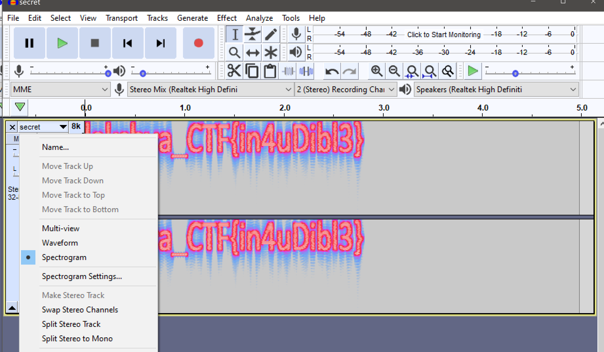

## Problem: See-the-sound

Can you visualise the spectrum of frequencies in the sound?

## Hint:
Spectogram

## Explanation:

Spectogram is a visual representation of the spectrum of frequencies in a sound over time. 

Start by opening the audio file in audacity tool. Click on it and select the spectogram option to view the spectogram of the sound file.

  

Flag: lakshya_CTF{in4uDibl3}
